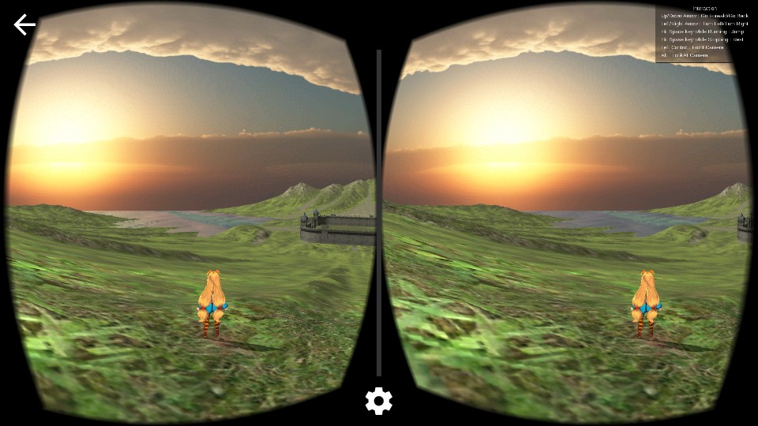

# UnityChan

<Final Project: Eojin Roh, Sumin Han, SeongHwei Lee> 
* Project Name: Magical Girl Unity Chan☆
* Git: The capacity is too large: we couldn't use git.
* Description: Socket.io Keyboard input + Voice Recognition + VR + Unity 3d Game.
* Characteristic: UnityChan is Pretty! When the VR market gets bigger in the futuer, we're pretty sure that this kind of game would be there. Currently, VR is not popular. But just in 2~3 years, when the computing power gets stronger, then I guess some people would actually live in this "Matrix World!".
* Download: https://drive.google.com/file/d/0B7gw5C73MSSmdEVTZmJHa0VlbW8/view

<Final 프로젝트 : 노어진 한수민 이성회> 
* 프로젝트 명 : 마법소녀 유니티 짱☆
* Git 주소 : 용량이 너무 큰 관계로 git을 사용할 수 없었습니다.
* 설명 : Socket.io 키보드 입력 + 음성 인식 + VR + Unity 3d 게임의 집합체.
* 특징 : 유니티 짱이 예쁩니다. 미래 가상현실 시장이 커졌을 때 충분히 시장에서 출범 할 만한 게임이라고 생각듭니다. 아직은 VR이 상용화 되지 않아서 휴대폰으로 돌리기엔 많이 벅차지만 2~3년 내로 충분히 네트워크나 그래픽을 처리하는 속도가 빨라지게 된다면 미래세계는 매트릭스 속에서 사람들이 실제로 살아가게 되지 않을까요!?!
다운로드 : https://drive.google.com/file/d/0B7gw5C73MSSmdEVTZmJHa0VlbW8/view
